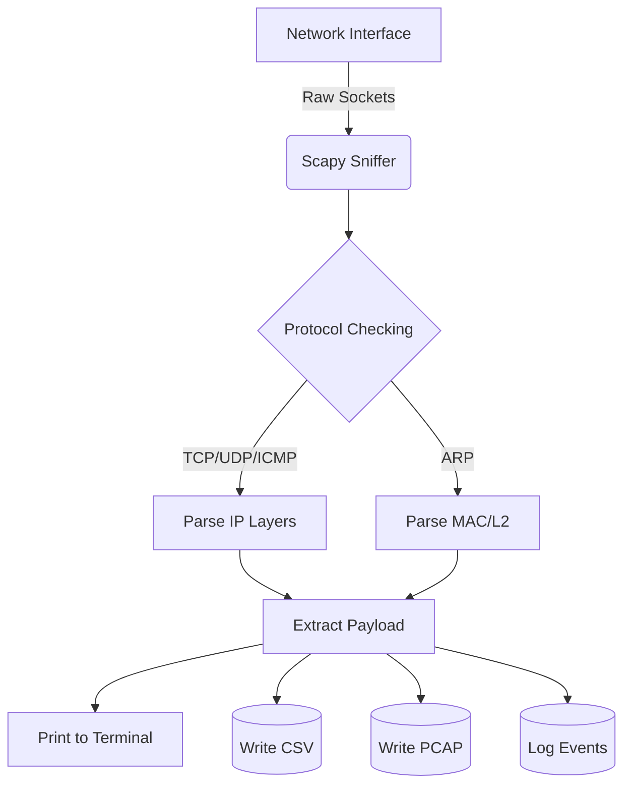
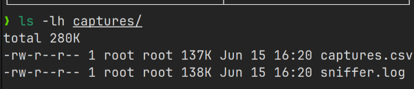

<div align="center">
  <h1>Basic Network Sniffer</h1>
  <p><strong>A Network Packet Capture Tool Built with Python and Scapy</strong></p>

  [](https://www.python.org)
  [](https://scapy.net)
  [](LICENSE)
</div>

---

## 📖 Overview
The **Basic Network Sniffer** is a Python-based utility developed to intercept, inspect, and log local network traffic. Utilizing the **Scapy** library, the tool classifies network protocols, extracts payload snippets, and saves the captured data to both CSV and PCAP files for later analysis. 

This project was built as a hands-on learning exercise during a **Cyber Security Internship** to better understand network fundamentals and Python programming.

## 👨‍💻 Author
**Amritesh Mishra**  
*Bachelor of Engineering (Computer Science Engineering)*  
*Cyber Security Internship Project*

## ✨ Features
- **Live Packet Capture:** Intercepts traffic on the local network interface using raw sockets.
- **Protocol Detection:** Detects and classifies TCP, UDP, ICMP, ICMPv6, and ARP packets.
- **Protocol Filtering:** Allows filtering by specific protocols (e.g., `--protocol TCP`).
- **Terminal UI:** Uses the `Rich` library to provide a clean, color-coded live terminal view.
- **Data Export (CSV & PCAP):** Saves captured metadata to `captures.csv` and raw packets to `captures.pcap` for use with Wireshark.
- **Event Logging:** Records capture events and errors to `sniffer.log`.
- **Capture Summary:** Displays total packets, capture duration, and a protocol breakdown automatically upon exit.

## 🏗️ Architecture



---

## 🚀 Installation Guide

> [!WARNING]
> Packet sniffing requires raw socket access. You must run this tool with root or Administrator privileges.

### 🐧 Ubuntu, Debian 13 (Trixie) & Kali Linux
Modern Debian-based systems require using virtual environments (PEP 668) rather than installing Python packages globally.

```bash
# 1. Update your system and install required tools
sudo apt update
sudo apt install python3 python3-pip python3-venv git

# 2. Clone the repository
git clone https://github.com/amrit-verse/sniffer.git
cd sniffer

# 3. Create and activate a Virtual Environment
python3 -m venv venv
source venv/bin/activate

# 4. Install requirements
pip install -r requirements.txt
```

### 🪟 Windows Setup
1. Install [Npcap](https://npcap.com/). Be sure to check **"Install Npcap in WinPcap API-compatible Mode"** during installation.
2. Install Python 3.12+ and make sure it is added to your PATH.
3. Open PowerShell as **Administrator**:
```powershell
git clone https://github.com/amrit-verse/sniffer.git
cd sniffer
python -m venv venv
.\venv\Scripts\activate
pip install -r requirements.txt
```

---

## 💻 Usage Examples

Run the script from your activated virtual environment with elevated privileges. 
*Note for Linux: Running `sudo` drops your user's path, so you should point `sudo` to the virtual environment's Python executable.*

**Basic Capture:**
```bash
sudo venv/bin/python sniffer.py
```

**Filter for TCP Traffic:**
```bash
sudo venv/bin/python sniffer.py --protocol TCP
```

**Select a Specific Interface and Export to PCAP:**
```bash
sudo venv/bin/python sniffer.py -i eth0 --pcap
```

**View the Help Menu:**
```bash
venv/bin/python sniffer.py --help
```

---

## 📸 Screenshots

### Packet Capture Demo

*A demonstration of the sniffer running in real-time, intercepting and printing packet metadata.*

### TCP Protocol Filter Demo

*Filtering the capture stream to isolate TCP packets using the `--protocol TCP` argument.*

### Session Summary Demo

*The shutdown summary that automatically displays when the user presses Ctrl+C.*

### Exported Files

*The generated `captures.csv` and `captures.pcap` files successfully saved for post-analysis.*

---

## 📚 Learning Outcomes
Building this project provided hands-on experience with:
- **Packet analysis:** Understanding how data travels across a network layer by layer.
- **Protocol inspection:** Differentiating between TCP handshakes, UDP datagrams, and ICMP pings.
- **Network traffic monitoring:** Utilizing scripts to passively observe and log traffic.
- **Python networking concepts:** Interacting with raw sockets, byte structures, and payload parsing.
- **Cybersecurity fundamentals:** Learning how defensive monitoring and offensive network tools are built.

## 💡 Project Reflection
**What was learned:** I gained a much deeper understanding of the OSI model and how Scapy can be used to pull apart network layers in Python. I also learned about PEP 668 and the importance of using virtual environments when deploying tools on modern Linux distributions.

**Challenges faced:** Handling packet payloads was difficult because arbitrary binary data would often crash my script with `UnicodeDecodeError`s. I had to implement `try-except` blocks to fall back to hexadecimal representations when ASCII decoding failed. Managing memory for long captures also led me to implement Scapy's `PcapWriter` for streaming data directly to disk instead of holding packets in RAM.

**Future improvements:** 
- Adding DNS query extraction to see exactly what websites are being resolved by the host.
- Adding a lightweight Graphical User Interface (GUI) for users who prefer not to use the command line.

---

## 📝 License
This project is open-source and licensed under the [MIT License](LICENSE).
