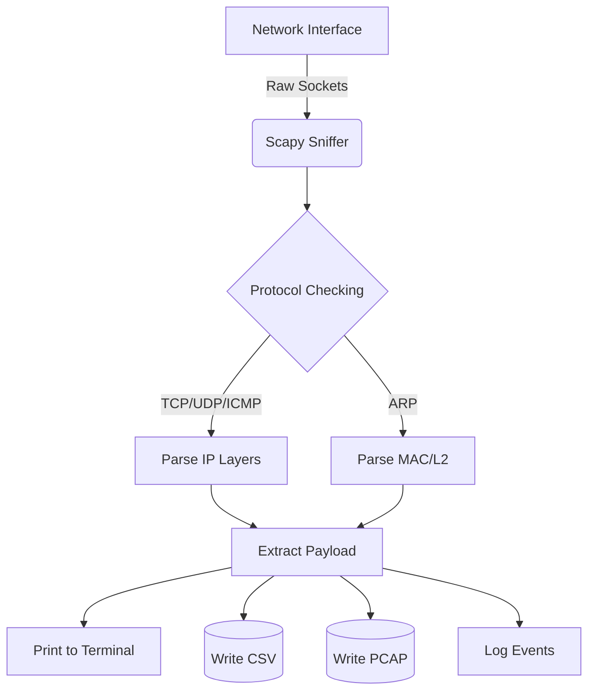
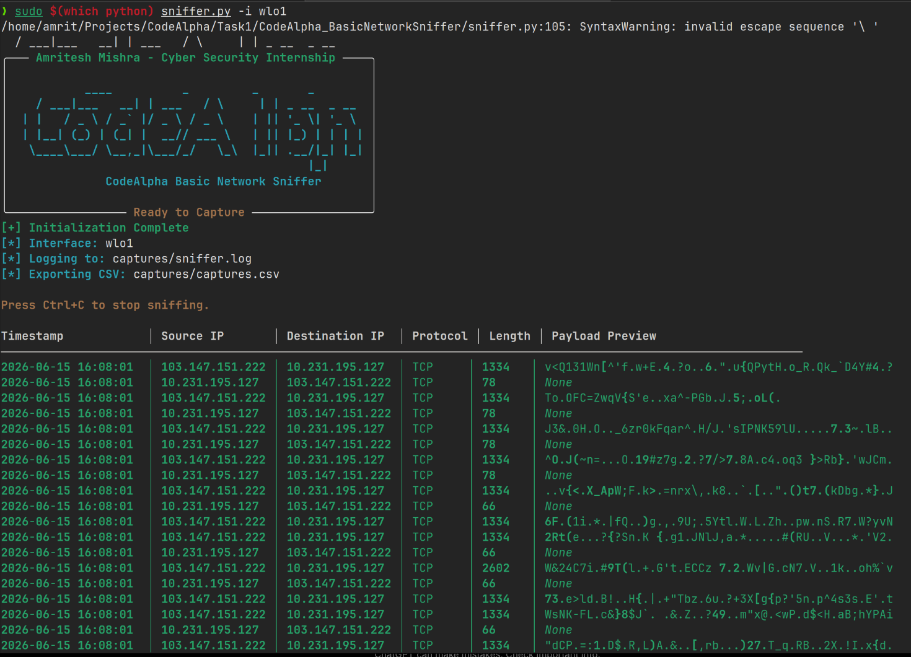
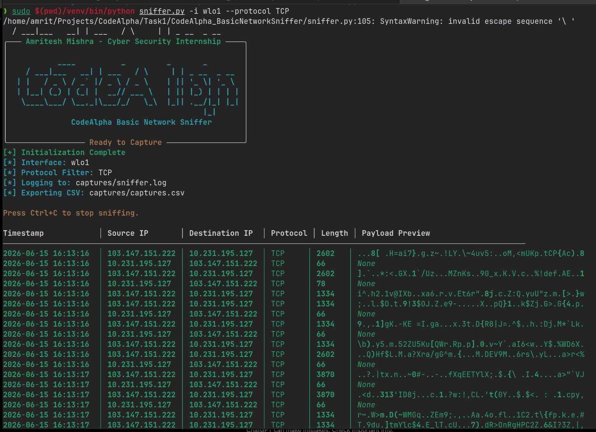
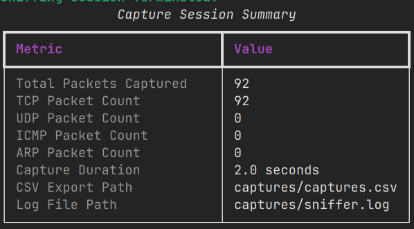

<div align="center">
  <h1>CodeAlpha Basic Network Sniffer</h1>
  <p><strong>A Network Packet Capture Tool Built with Python and Scapy</strong></p>

  [](https://www.python.org)
  [](https://scapy.net)
  [](LICENSE)
</div>

---

## 📖 Overview
The **CodeAlpha Basic Network Sniffer** is a Python-based utility created to intercept, inspect, and log live network traffic. Utilizing the **Scapy** library, the tool can classify network protocols, extract payload snippets, and save the data to both CSV and PCAP files. 

This project was built as a learning exercise during the **CodeAlpha Cyber Security Internship**.

## 👨‍💻 Author
**Amritesh Mishra**  
*Bachelor of Engineering (Computer Science Engineering)*  
*CodeAlpha Cyber Security Internship Project*

## ✨ Features
- **Live Packet Capture:** Intercepts traffic on the local network using raw sockets.
- **Protocol Classification:** Detects TCP, UDP, ICMP, ICMPv6, and ARP packets.
- **Terminal UI:** Uses the `Rich` library to provide a clean, color-coded terminal view.
- **Data Export:** Saves captured data to `captures.csv` and optionally to `captures.pcap` for use with Wireshark.
- **Payload Extraction:** Extracts and displays readable ASCII payloads or falls back to hexadecimal.
- **Protocol Filtering:** Allows filtering by specific protocols (e.g., `--protocol TCP`).
- **Capture Summary:** Displays total packets, duration, and protocol breakdown on exit.

## 🏗️ Architecture



---

## 🚀 Installation Guide

> [!WARNING]
> Packet sniffing requires raw socket access. You will need to run this tool with root or Administrator privileges.

### 🐧 Debian 13 (Trixie) & Kali Linux
Modern Debian-based systems require you to use virtual environments (PEP 668) rather than installing Python packages globally.

```bash
# 1. Update your system and install venv/git
sudo apt update
sudo apt install python3 python3-pip python3-venv git

# 2. Clone the repository
git clone https://github.com/amrit-verse/sniffer.git
cd CodeAlpha_BasicNetworkSniffer

# 3. Create and activate a Virtual Environment
python3 -m venv venv
source venv/bin/activate

# 4. Install requirements
pip install -r requirements.txt
```

### 🪟 Windows Setup
1. Install [Npcap](https://npcap.com/). Be sure to check **"Install Npcap in WinPcap API-compatible Mode"** during installation.
2. Install Python 3.12+ and make sure it's added to your PATH.
3. Open PowerShell as **Administrator**:
```powershell
git clone https://github.com/amrit-verse/sniffer.git
cd CodeAlpha_BasicNetworkSniffer
python -m venv venv
.\venv\Scripts\activate
pip install -r requirements.txt
```

---

## 💻 Usage Examples

Run the script from your activated virtual environment with elevated privileges. 
*Note for Linux: Running `sudo` drops your user's path, so you should point `sudo` to the virtual environment's python executable.*

**Basic Capture:**
```bash
sudo venv/bin/python sniffer.py
```

**Filter for TCP Traffic:**
```bash
sudo venv/bin/python sniffer.py --protocol TCP
```

**Select a Specific Interface and Export to PCAP:**
```bash
sudo venv/bin/python sniffer.py -i eth0 --pcap
```

**View the Help Menu:**
```bash
venv/bin/python sniffer.py --help
```

---

## 📸 Screenshots

### Packet Capture Demo


### TCP Protocol Filter Demo


### Session Summary Demo


---

## 📚 Learning Outcomes
Building this project provided hands-on experience with:
- **Packet analysis:** Understanding how data travels across a network.
- **Protocol inspection:** Differentiating between TCP handshakes, UDP datagrams, and ICMP pings.
- **Network traffic monitoring:** Utilizing tools to passively observe traffic.
- **Python networking concepts:** Interacting with raw sockets and byte structures.
- **Cybersecurity fundamentals:** Learning how defensive and offensive network tools are built.

## 💡 Project Reflection
**What was learned:** I gained a much deeper understanding of the OSI model and how Scapy can be used to pull apart network layers in Python. I also learned about PEP 668 and the importance of virtual environments when deploying tools on Linux.

**Challenges encountered:** Handling payloads was difficult because arbitrary binary data would often crash my script with `UnicodeDecodeError`s. I had to implement try-except blocks to fall back to hexadecimal representations when ASCII decoding failed. Managing memory for long captures also led me to implement Scapy's `PcapWriter` for streaming data to disk instead of holding packets in RAM.

**Possible future improvements:** 
- Adding DNS query extraction to see exactly what websites are being resolved.
- Adding a lightweight Graphical User Interface (GUI).

---

## 📝 License
This project is open-source and licensed under the [MIT License](LICENSE).
